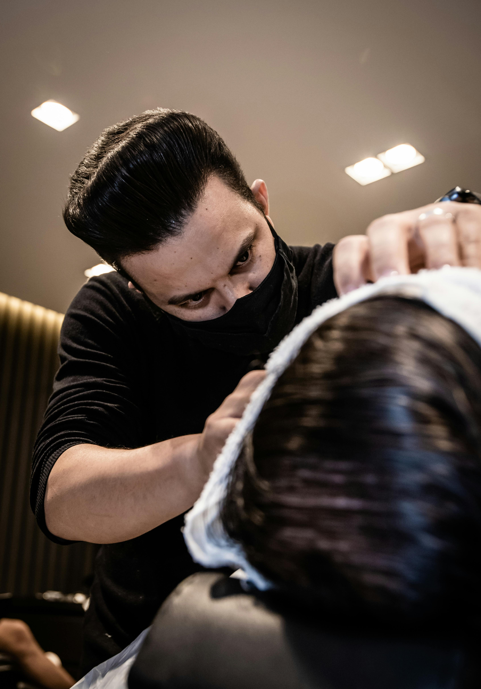

# 💈 Barbearia Primus

Site desenvolvido para uma barbearia, com foco em design moderno, responsividade e facilidade de agendamento.

---

## 🌐 Acesse o projeto

🔗 [Clique aqui para ver o site](https://rrenatodevs.github.io/Projeto-BarberShop/)

---

## 📸 Preview



---

## 🛠️ Tecnologias utilizadas

- HTML5  
- CSS3  
- Git e GitHub  

---

## 📱 Funcionalidades

- Layout moderno e responsivo  
- Navegação com scroll suave  
- Integração com WhatsApp para agendamentos  
- Estrutura organizada e semântica  

---

## 🎯 Objetivo do projeto

Este projeto foi desenvolvido com o objetivo de praticar e consolidar conhecimentos em desenvolvimento web, especialmente na criação de interfaces responsivas e funcionais.

---

## 📚 Aprendizados

Durante o desenvolvimento, foram trabalhados conceitos como:

- Estruturação semântica com HTML  
- Organização e estilização com CSS  
- Responsividade para diferentes dispositivos  
- Integração com links externos (WhatsApp)  

---

## 📂 Como executar o projeto

1. Clone o repositório:
```bash
git clone https://github.com/rrenatodevs/barbearia-primus.git
